# Quantum Portfolio Optimization with VQE
This project explores quantum variational algorithms for portfolio optimization using real stock return data.

## Research Goal
Can a quantum algorithm (VQE) outperform a classical random search (Monte Carlo) in identifying optimal asset allocations?

## Approach
Quantum Algorithm: Variational Quantum Eigensolver (VQE)

Objective: Maximize return with a custom Hamiltonian that encodes: TwoLocal parameterized circuit, Optimiser of COBYLA, Backend of Qiskit Aer simulator

## Classical Baseline
Monte Carlo simulation of 100+ random portfolios. Simulates portfolio growth across 250 trading days, returns best classical portfolio based on average simulated return

## Research

We explored the capabilities of Variational Quantum Eigensolver (VQE) for continuous portfolio optimization and benchmarked it against a classical Monte Carlo simulation approach. Both methods were tested across varying:

- **Portfolio sizes**: 3–16 assets  
- **Circuit depths**: `reps = 2` and `reps = 3`  
- **Risk aversion levels**: 0.3, 0.5, 0.8  
- **Number of sampled portfolios (classical)**: 50–200  

Our results are summarized through two major analyses:

- **Analysis 3**: Small-scale (3–5 assets), fewer sampled portfolios  
- **Analysis 4**: Scaled-up test (4–16 assets), full grid search  

In a focused test with 4 assets, the quantum method outperformed the classical approach in Sharpe ratio and cumulative return. However, in a larger, grid search, the quantum approach did not consistently outperform the classical baseline. It did, however, remain competitive in the 4-asset case, especially as risk aversion increased — where quantum returns increased linearly, highlighting the structure of the Hamiltonian.

### Sharpe Ratio Advantage in Small Portfolios

  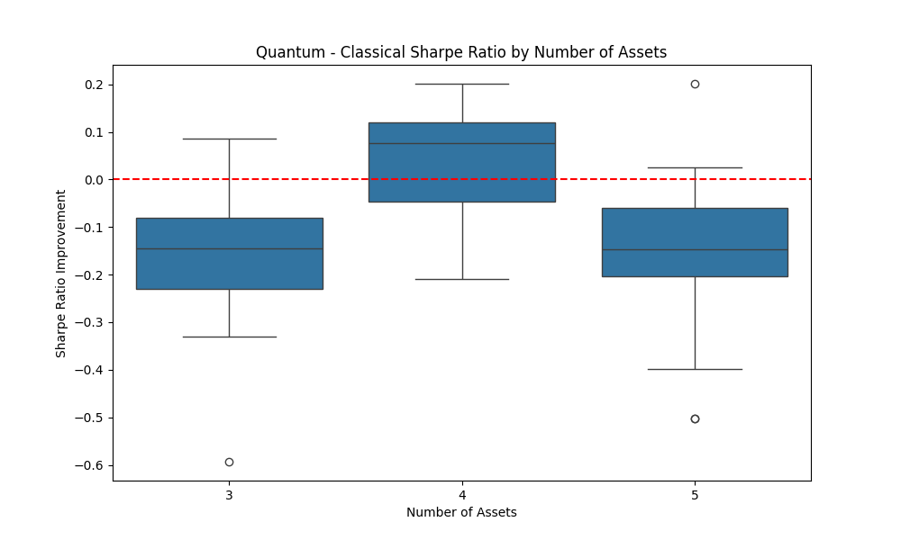
  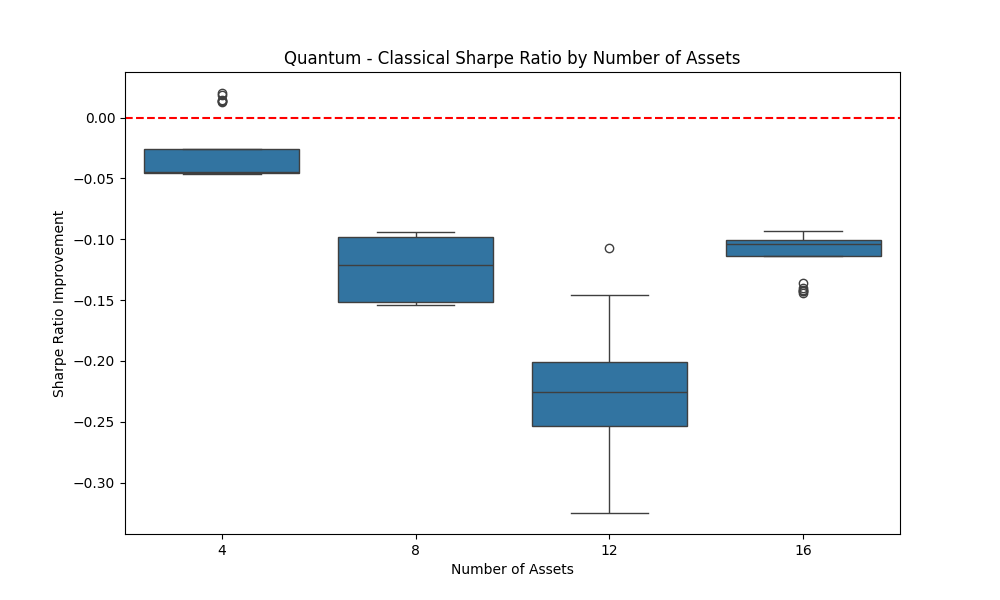

In **Analysis 3**, the quantum algorithm outperformed classical in Sharpe ratio for 4-asset portfolios by ~0.1 on average. This suggests that quantum optimization may better capture useful correlations or structure in smaller search spaces where classical random sampling lacks resolution.

However, in **Analysis 4**, which included up to 16 assets, classical methods consistently outperformed quantum, often by ~0.15 Sharpe ratio. These results indicate that **quantum advantage is sensitive to problem dimensionality** — effective at small scale, but less competitive as complexity grows.

This also shows how the simulation adjusts differently when trying initial optimisations v when it learns to optimise and then works on a scale of 4 assets compared to it intially being tested on its optimum scale.  

### Sharpe Heatmap: Risk Aversion & Circuit Depth Sensitivity

  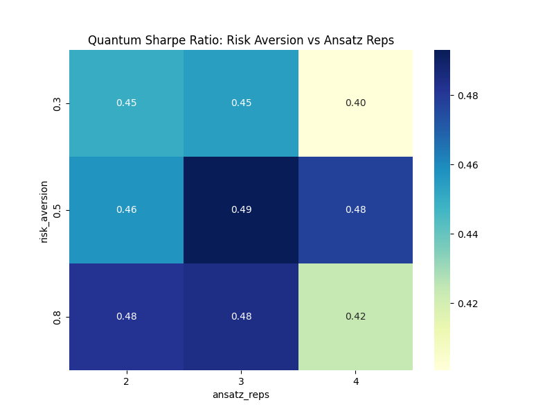
  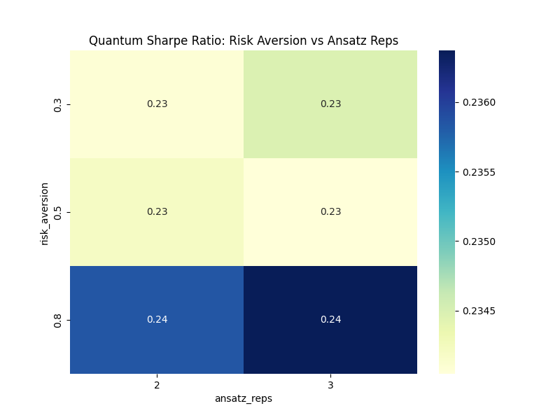

Both analyses show that **risk aversion = 0.5** and **ansatz reps = 3** tend to get the best quantum Sharpe ratios.

- In Analysis 3, this setup achieved a Sharpe ratio of ~0.49, with risk aversion 0.8 outperforming 0.3 by ~0.03.
- In Analysis 4, Sharpe ratios dropped across the board — highlighting the challenge of scaling quantum optimisation.

These heatmaps show the **importance of tuning quantum circuit depth** and the Hamiltonian’s risk-return balance. VQE seems to be sensitive to these parameters, which can effect optimisation quality.

### Risk-Return Behavior: Quantum Consistency vs Classical Outliers

  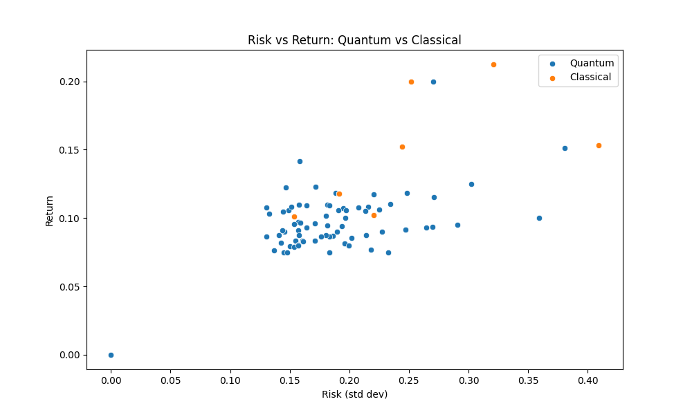
  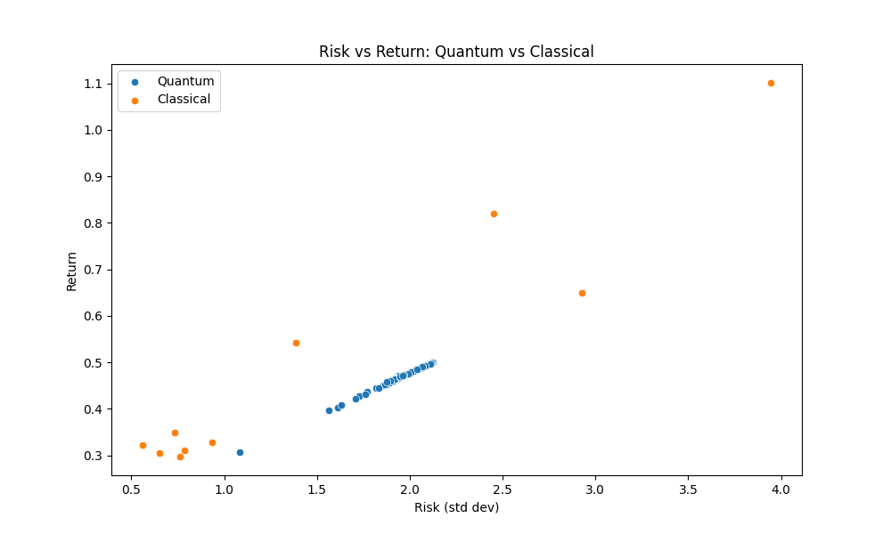

- **Analysis 3 (Left)**: Quantum and classical returns are closely clustered around (-0.1 return, -0.155 risk). Quantum occasionally outperforms but mostly remains in line with classical performance.
- **Analysis 4 (Right)**: Quantum portfolios align on a narrow **linear return-to-risk line** (~0.4–0.5 return vs. 1.5–2.2 risk), demonstrating consistency. Classical results are more dispersed, with a few outliers outperforming, but the majority falling below the quantum trend.

This behavior highlights a critical insight:  
>  **Quantum VQE delivers predictable, stable risk-adjusted returns — classical outperformance might rely “lucky shots.”**

The quantum results’ linearity reflects the cost Hamiltonian’s structure, where return is linear in expected asset value, and increasing risk aversion intensifies the covariance penalty.

---

## Key Takeaways

1. **Quantum advantage is size-sensitive.**  
   For small portfolios (e.g., 4 assets), VQE consistently achieved higher Sharpe ratios than classical Monte Carlo.

2. **Quantum optimization does not scale linearly.**  
   As portfolio size increases (8, 12, 16), classical random sampling benefits from more dimensions and overtakes quantum performance.

3. **Quantum returns scale linearly with risk.**  
   This confirms the VQE cost Hamiltonian behaves as expected, adjusting proportionally to risk aversion and enforcing predictable portfolio dynamics.

4. **Stability vs. volatility:**  
   Quantum portfolios are consistent and follow theoretical gradients, while classical outcomes are volatile — occasionally outperforming, but mostly inferior in mid- and high-risk settings.

---

## All Experiments Graphs (1 to 4, left to right)

  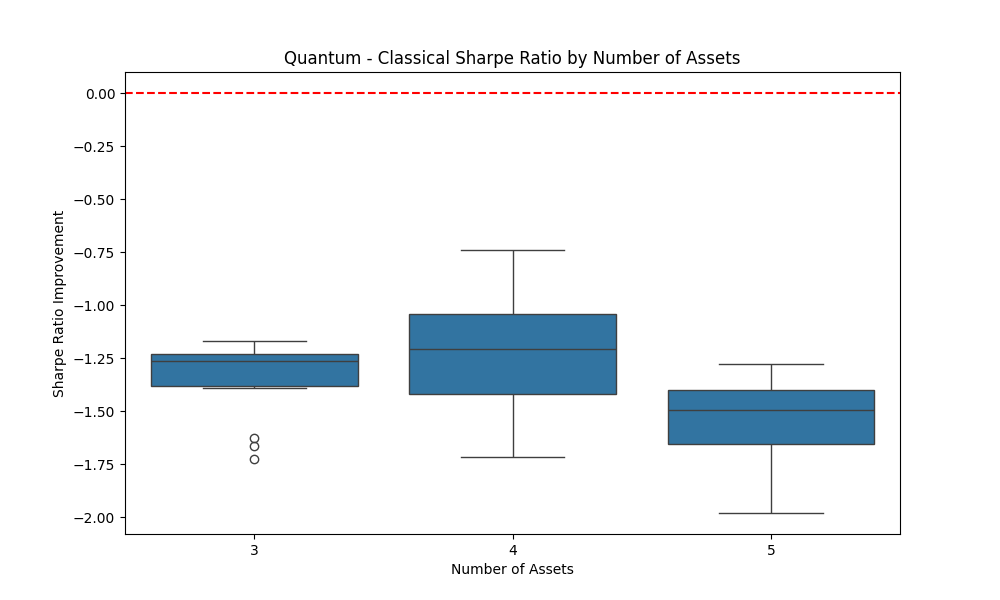
  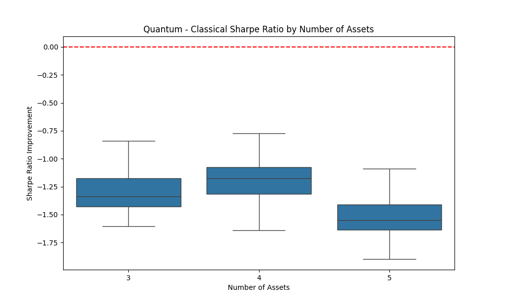
  
  

  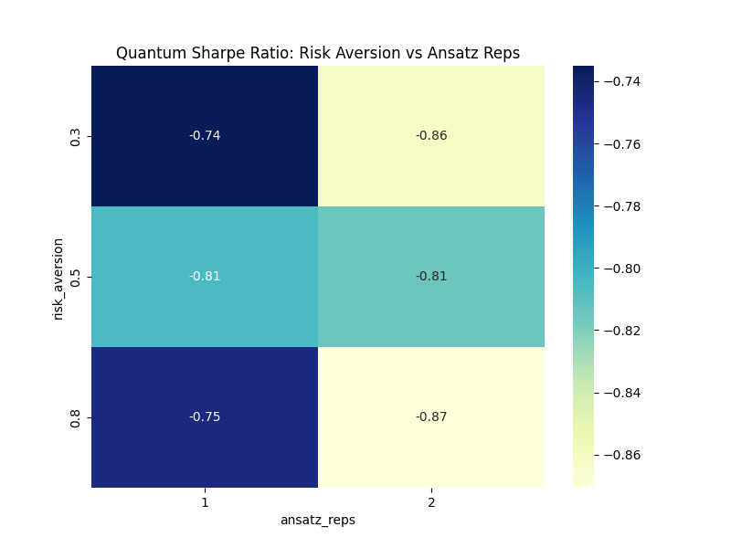
  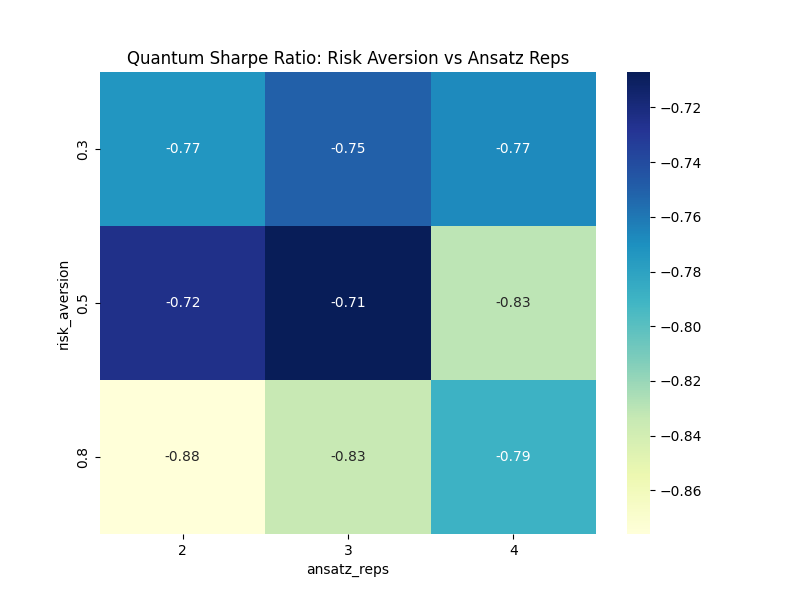
  
  

  
  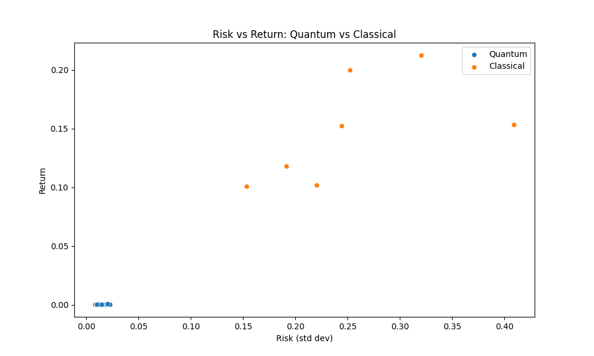
  
  

